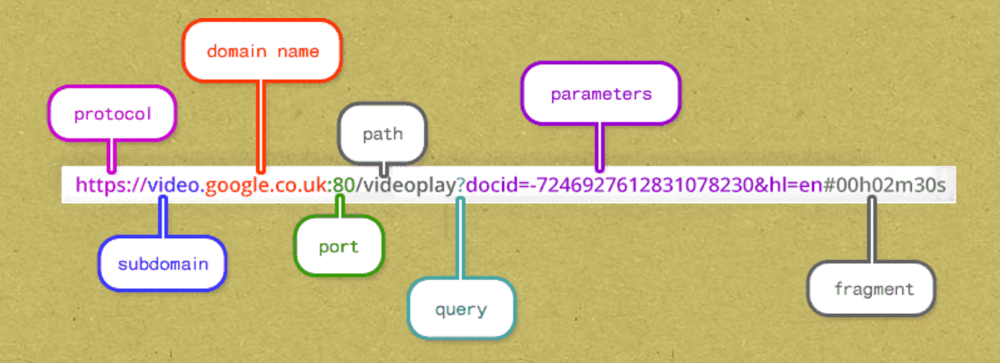

<h1>Passing Values</h1>
<h2>Form submission</h2>

We can pass values from the client to the server through the URL or 
    through the body of the request.

When you submit a form, you can use either the "POST" or "GET" method. 
    The "POST" method sends the form submission through the body of the request.
The "GET" method for a form submission sends the form submission values through the url.

I remember like this:

<ul>
    <li>post</li>
    <li>body</li>
    .  
    .  
    <li>get</li>
    <li>url</li>
</ul>

    <b>POST</b> has four letters and so does <b>form</b>
    <b>GET</b> has three letters and so does <b>url</b>

   

<h2>URL values</h2>

You can always append values to a URL.

Anything after the <b>?</b> is the query string - the area where values are stored.

 

  

The values are stored in a <i>identifier=value</i> fashion.

You can have multiple <i>identifier=value</i> by separating them with the <b>&</b>
ampersand.

<h2>Retrieving values</h2>

While there are multiple ways to retrieve values, we will stick with:

func (*Request) FormValue

  

func (r *Request) FormValue(key string) string

  

FormValue returns the first value for the named component of the query. <b>POST</b> and <b>PUT</b>
body parameters take precedence over URL query string values. FormValue calls ParseMultiplePartForm and ParseForm

if necessary and ignores any errors returned by these functions. If key is 
not present, FormValue returns the empty string. To access multiple values of the same key,
call ParseFormand then inspect Request.Form directly.

